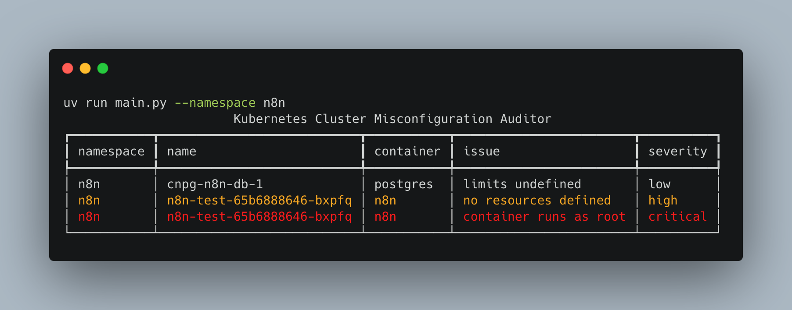
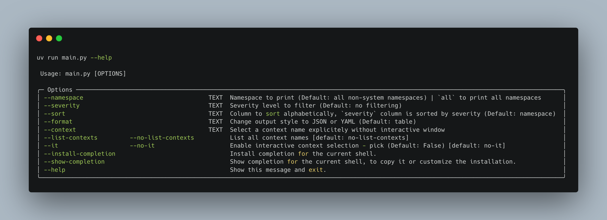

# Kubernetes misconfiguration auditor

## The spec

CLI tool that connects to Kubernetes cluster and audits workloads for common misconfigurations, improving cluster stability and efficiency. It checks for:

1. **Pods/containers without resource requests or limits**
2. **Pods/containers running as root**
3. **Pods without liveness or readiness probes**
4. **Pods using `latest` tag**
5. **Namespaces to scan** - configurable (default: all non-system namespaces)

## Libraries used

| Library | Purpose |
|---|---|
| `typer` | CLI arguments |
| `pick` | Select which kubernetes cluster to use |
| `kubernetes` | Connect to cluster, list pods, read specs |
| `rich` | Beautiful table output in terminal |
| `dataclass` | Bundle variables together in a class |
| `datetime` | Show time in JSON and YAML formated outputs |
| `json` | Formats data as JSON |
| `yaml` | Formats data as YAML |

## Prerequisites

- **python**
- **uv** or *pip*
- **Kubernetes cluster**

## How to run the tool

1. Clone this repo

```bash
git clone https://github.com/POCOCZE/KubernetesMisconfigurationAuditor.git
cd KubernetesMisconfigurationAuditor
```

2. Create venv

```bash
# with uv (recommended for this project)
uv sync

# with pip
python -m venv .venv
source .venv/bin/activate  # on Windows: .venv\Scripts\activate
pip install -r requirements.txt
```

3. Install packages

```bash
# with uv
uv run main.py

# with pip (after activating venv)
python main.py
```

## Available CLI options



## Notes

### Findings data structure

- Command used: `uv run main.py --namespace n8n --sort severity`
- Line of code in `main()`: `console.print(misconf_auditor.findings)`

Raw output of `findings` variable in `KubernetesMisconfigurationAuditor` class:

```py
[
    Findings(time='2026-03-20T22:36:50.407264', namespace='n8n', name='cnpg-n8n-db-1', container='postgres', issue='limits undefined', severity='low'),
    Findings(time='2026-03-20T22:36:50.407283', namespace='n8n', name='n8n-test-65b6888646-vvtxp', container='n8n', issue='no resources defined', severity='high'),
    Findings(time='2026-03-20T22:36:50.407283', namespace='n8n', name='n8n-test-65b6888646-vvtxp', container='n8n', issue='container runs as root', severity='critical')
]
```

*The output is just for illustration purposes. The line of code in `main()` is not trully present.*
